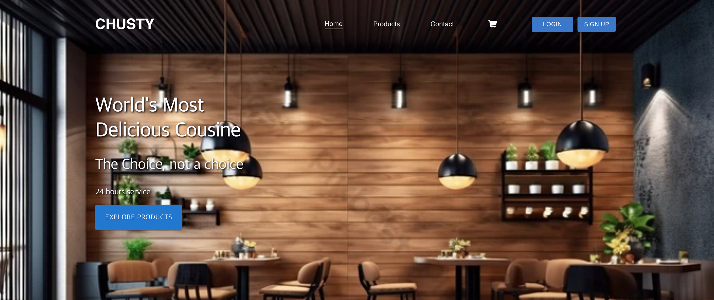
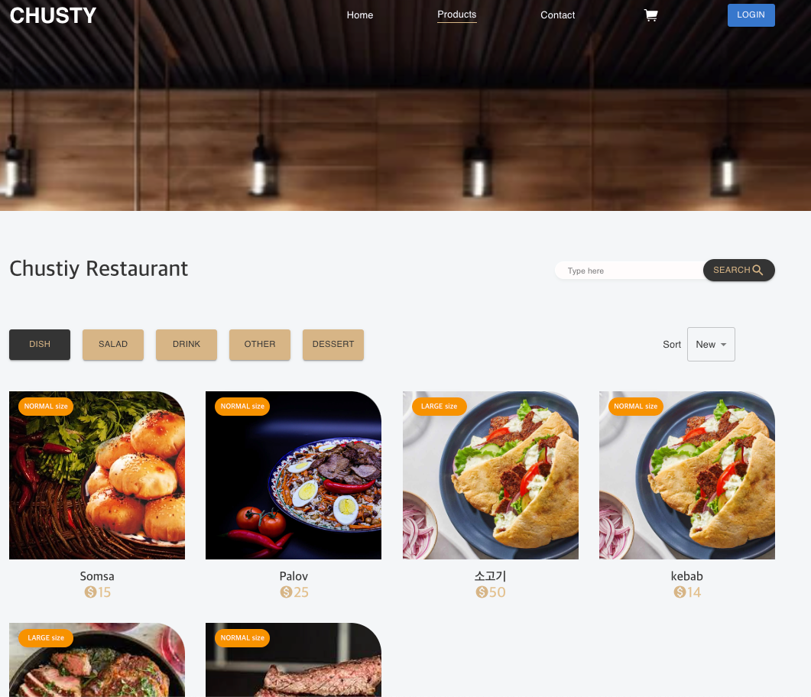
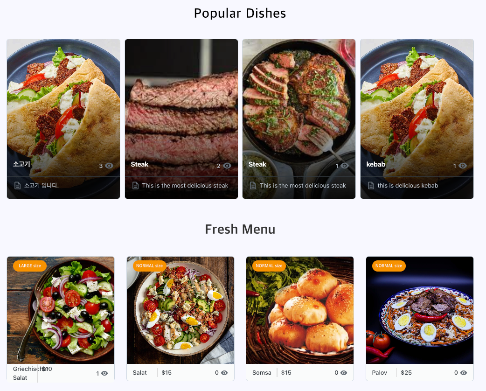
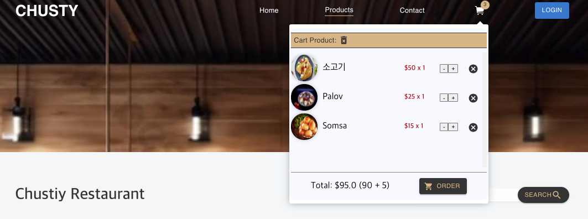
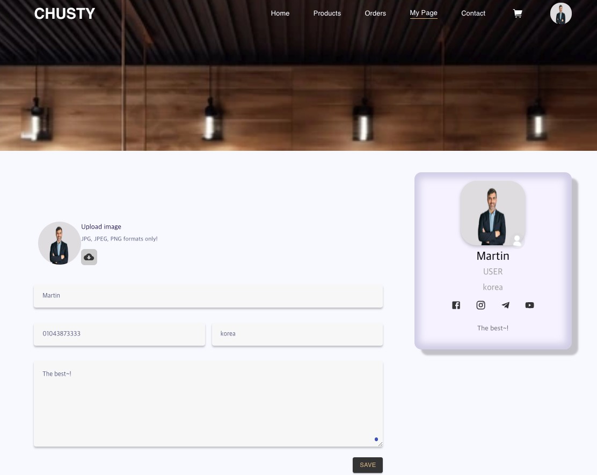

# Chusty Project Frontend (React)

Chusty 프로젝트의 일반 사용자(B2C)를 위한 프론트엔드 어플리케이션(SPA)입니다. [Chusty Backend](https://github.com/your-username/chusty) 서버와 통신하여 식당 정보 조회, 메뉴 주문, 사용자 정보 관리 등의 비즈니스 로직을 화면에 렌더링합니다.

## Tech Stack

- **Core**: React (v18), TypeScript
- **State Management**: Redux Toolkit, React-Redux
- **Styling & UI**: Material-UI (MUI v5), Emotion, Styled-Components
- **Routing**: React Router DOM (v5)
- **Networking & Real-time**: Axios, Socket.io-client
- **Etc**: SweetAlert2 (알림 UI), Swiper (이미지 슬라이더), Universal Cookie (세션 관리)

## Key Features

- **사용자 인증 유지 (Session & Cookie):** 백엔드 서버에서 발급한 세션을 쿠키로 관리하여 새로고침 시에도 로그인 상태 유지.
- **반응형 UI 설계:** MUI v5와 Styled-Components를 결합하여 컴포넌트 재사용성을 높이고 모던한 UI 구현.
- **전역 상태 관리:** Redux Toolkit을 도입하여 사용자 정보, 장바구니 상태 등을 효율적으로 관리.
- **실시간 소켓 통신:** Socket.io-client를 사용하여 서버와 양방향 통신 구현.

## UI Screenshots

프로젝트의 주요 화면 스크린샷입니다.

### 1. 홈 화면 (Home)
메인 배너 및 추천 식당/메뉴를 확인할 수 있는 첫 페이지입니다.


### 2. 전체 상품 (Products)
등록된 전체 메뉴를 확인하고 필터링할 수 있는 페이지입니다.


### 3. 추천/신선 메뉴 (Fresh Menu)
특정 카테고리에 속하는 메뉴들을 강조해서 보여주는 화면입니다.


### 4. 장바구니 및 결제 카드 (Card / Cart)
주문할 상품들을 담아두고 결제하는 인터페이스입니다.


### 5. 마이페이지 (My Page)
사용자 개인 정보 수정 및 주문 내역을 확인할 수 있는 페이지입니다.


## Architecture & Technical Decisions

단순히 UI를 그리는 것을 넘어, **확장성과 유지보수성**을 고려하여 프론트엔드 아키텍처를 설계했습니다.

### 1. Feature-based Slice & Redux Toolkit
전역 상태를 관리할 때 하나의 거대한 Store를 두지 않고, 화면(Feature) 단위로 Slice를 분할했습니다. (`homePage`, `productsPage`, `ordersPage` 등) 이를 통해 각 페이지 컴포넌트는 자신이 필요한 상태 모델(State)과 액션만 구독하며, 코드의 결합도를 낮추고 추후 기능 확장 시 사이드 이펙트를 최소화했습니다.

### 2. Frontend Service Layer 도입
백엔드 패턴에서 착안하여 프론트엔드 내에서도 API 호출 계층을 분리했습니다. `src/app/services` 폴더에 `MemberService`, `ProductService`, `OrderService` 클래스를 두어 Axios 호출 로직을 캡슐화했습니다. 컴포넌트는 비즈니스/통신 로직을 직접 알 필요 없이 Service 메서드만 호출하면 되므로 UI 로직과 통신 로직이 완벽히 분리됩니다.

### 3. 공통 에러 및 환경 변수 중앙화
`src/lib/config.ts`를 통해 백엔드 통신용 URL(`REACT_APP_API_URL`)을 환경 변수로 관리하고, 어플리케이션 전반에서 사용되는 에러/경고 메시지(Validation Message 등)를 상수로 정의하여 일관된 사용자 경험(UX)과 다국어 확장을 고려했습니다.

## Directory Structure

```text
src/
├── app/
│   ├── components/  # 여러 화면에서 재사용되는 UI 컴포넌트 모음
│   ├── screens/     # 페이지 단위 컴포넌트 (Home, Products, Orders 등) 및 개별 Redux Slice
│   ├── services/    # 백엔드 API 통신을 전담하는 Service Layer 클래스 모음
│   └── store.ts     # 각 Screen의 Slice를 결합하는 Redux Root Store
├── lib/
│   ├── config.ts    # API URL 및 글로벌 메시지 상수 관리
│   └── types/       # TypeScript 인터페이스 및 타입 정의
├── index.tsx        # 진입점, Redux Provider 및 테마(MUI) 설정 적용
└── ...
```

## Getting Started

백엔드 서버가 로컬에서 구동 중이라는 가정하에 프론트엔드를 실행하는 방법입니다.

### 1. 백엔드 서버 실행 확인
먼저 `chusty` 백엔드 프로젝트가 포트 **3003**에서 실행 중이어야 합니다 (`http://localhost:3003`). 프론트엔드의 `Axios` 및 `Socket.io` 기본 통신 주소가 해당 포트를 바라보게 됩니다.

### 2. 의존성 설치
이 프로젝트는 `yarn` 패키지 매니저를 기반으로 합니다.
```bash
yarn install
```

### 3. 프로젝트 실행
개발 서버를 실행합니다.
```bash
yarn start
```
서버가 정상적으로 켜지면 `http://localhost:3000` 에서 프론트엔드 어플리케이션을 확인할 수 있습니다.
